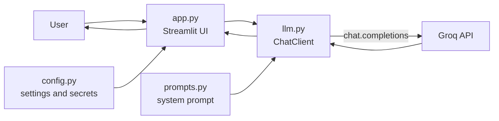

# Study Buddy: AI Chatbot (Streamlit + Groq)

A production-style AI chatbot. The user sends a message, the app calls an LLM through the Groq API, and the answer is shown as Markdown in a chat UI. The bot has a defined role and personality ("Study Buddy", a friendly AI tutor).

**Demo:** _add your Streamlit Cloud URL here_  

<!-- Add screenshot.png to the repo root, or replace with a demo video link. -->

## Features
| Day | Feature |
|---|---|
| 1 | Chat UI, Groq API call, history, loading spinner, Markdown |
| 2 | Structured **system prompt** (role, personality, rules, format), robust API integration (timeout, retries, model fallback), friendly error handling, logging, unit tests |
| 3 | **Voice input** (mic → Groq Whisper) and **voice output** (browser speech), **input validation**, **token control** (history limits, answer cap, low reasoning effort, short prompt, token counter) |

## Architecture


| File | Responsibility |
|---|---|
| `app.py` | UI only: chat window, spinner, sidebar, shows errors |
| `llm.py` | All AI logic: API call, model fallback, token control, speech-to-text, error mapping, logging (no Streamlit imports, so it is testable) |
| `voice.py` | Voice helpers: cleans Markdown before speaking, builds the Listen/Stop button |
| `prompts.py` | The system prompt (role, personality, rules, format) |
| `config.py` | Reads secrets/settings from Streamlit secrets or `.env` |
| `tests/test_llm.py` | Unit tests with a fake Groq client (no network, no key needed) |
| `check_models.py` | Prints the models your Groq key can use |

## Design decisions (and alternatives I did not use)
| Decision | Why | Alternative not used | Why not |
|---|---|---|---|
| Fixed system prompt in `prompts.py` | Role and rules are controlled by the developer; users cannot override them | Editable prompt box in the UI | Users could change the bot's role or bypass its rules |
| Split into `app/llm/config/prompts` | Separation of concerns; AI logic can be tested without the UI | One big `app.py` | Hard to test and maintain |
| Plain Groq SDK | Full control, easy to explain, few dependencies | LangChain / LlamaIndex | Heavy abstractions for a simple chat; hides what happens |
| SDK `timeout` + `max_retries` | Built-in retry with backoff for 429/5xx/network errors | Custom retry loop / `tenacity` | SDK already does it; less code, fewer bugs |
| Model discovery + fallback chain | Groq retires models (my first model returned 404) | Hardcoded model name | Breaks when the model is retired |
| `ChatError` with user-safe messages | Users get clear, actionable messages; details go to logs | Show raw exceptions / generic "error" | Leaks internals / not actionable |
| Python `logging` | Levels, timestamps, easy to redirect | `print()` | No levels, hard to filter |
| Mocked unit tests | Fast, free, repeatable | Real API calls in tests | Needs a key, costs quota, flaky |
| Voice input with Groq Whisper (`st.audio_input`) | Same API key, accurate, supports Urdu | Browser Web Speech API / extra libraries | Chrome-only, needs custom JS components, less reliable |
| Voice output with browser `speechSynthesis` | Free, no server, no extra package | gTTS / cloud TTS (ElevenLabs, Google) | Extra network call, cost or keys; Roman Urdu is read badly by any engine |
| Token control (10 msgs / 4000 chars, `max_tokens`, `reasoning_effort=low`, short prompt) | Lower cost and faster answers | Send full history, no limits | Cost and latency grow with every message |
| Input limit (1000 chars) | Blocks very long, expensive messages | No validation | Unbounded cost |
| Full history resent (last 10 messages) | LLMs are stateless; bounds cost and context size | Send everything / database memory | Cost grows; a database is overkill for now |

## Technology
Python 3.9+, Streamlit (1.40+ for `st.audio_input`), Groq Python SDK (chat + Whisper), python-dotenv, pytest.

## Run locally
```bash
git clone <your-repo-url>
cd <repo>
python -m venv venv
venv\Scripts\activate                 # macOS/Linux: source venv/bin/activate
python -m pip install -r requirements.txt

copy .env.example .env                # macOS/Linux: cp .env.example .env
# edit .env:  GROQ_API_KEY=your-key   (no quotes, no spaces)

python -m streamlit run app.py
```
Run the tests: `python -m pip install -r requirements-dev.txt` then `python -m pytest -q`

> Never commit `.env` or put a real key in `.env.example`. GitHub push protection blocks pushes that contain keys.

> Voice notes: you can also upload an audio file instead of recording. the microphone works on `localhost` and on HTTPS (Streamlit Cloud); the browser will ask for permission. Voice quality for Urdu depends on the voices installed in your browser/OS.

## Deploy (Streamlit Community Cloud)
1. Push the repo to GitHub (without `.env`).
2. On https://share.streamlit.io create an app with main file `app.py`.
3. App settings → Secrets:
   ```toml
   GROQ_API_KEY = "your-key"
   ```

## How the chatbot works
1. The user types a message; `app.py` appends it to `st.session_state.messages`.
2. `ChatClient.reply()` builds `[system prompt] + recent history (max 10 messages / 4000 chars)` and calls Groq with `max_tokens` set.
3. It picks the first usable model; if Groq says "model not found" it tries the next one.
4. Known failures (bad key, rate limit, network, empty answer) become a `ChatError`; unknown failures are logged and shown as a generic message. A failed message is removed so the user can retry.
5. The answer is rendered as Markdown and added to the history.

## Problems and solutions
| Problem | Cause | Solution |
|---|---|---|
| `404` from Groq on every question | Default model `llama-3.3-70b-versatile` was retired by Groq (16 Aug 2026) | Discover available models with `models.list()` and fall back automatically; clearer error messages |
| `uvicorn`/`streamlit` "not recognized" on Windows | Scripts folder not on PATH | Use `python -m streamlit ...` |
| Git push `403` | Windows had cached a different GitHub account | Remove the saved credential and set the remote URL with the right username |
| Push blocked: "Push cannot contain secrets" | A real API key was in `.env.example` | Replace it with a placeholder, **revoke and recreate the key**, rebuild the Git history, keep the key only in `.env` |
| Streamlit Cloud cannot host FastAPI | It only runs Streamlit apps | Simplified to a Streamlit-only architecture |

## What I learned
- How to call an LLM API, keep secrets out of Git, and structure a small app into layers.
- A system prompt defines role, tone and rules; it should be written like a spec.
- LLMs are stateless, so history must be resent; Streamlit reruns the script on each interaction.
- Cost control: tokens are spent on history, the system prompt, hidden reasoning and the answer, so each can be limited.
- Voice: speech-to-text needs a model (Whisper), while text-to-speech can run free in the browser.
- External APIs change (models get retired), so production code needs timeouts, retries, fallbacks and clear errors.
- Unit tests with a fake client make API code safe to change.

## Next improvements
- Streaming responses token by token.
- Summarise old messages instead of dropping them.
- Persist conversations; add login and rate limiting.
- Voice input/output.
